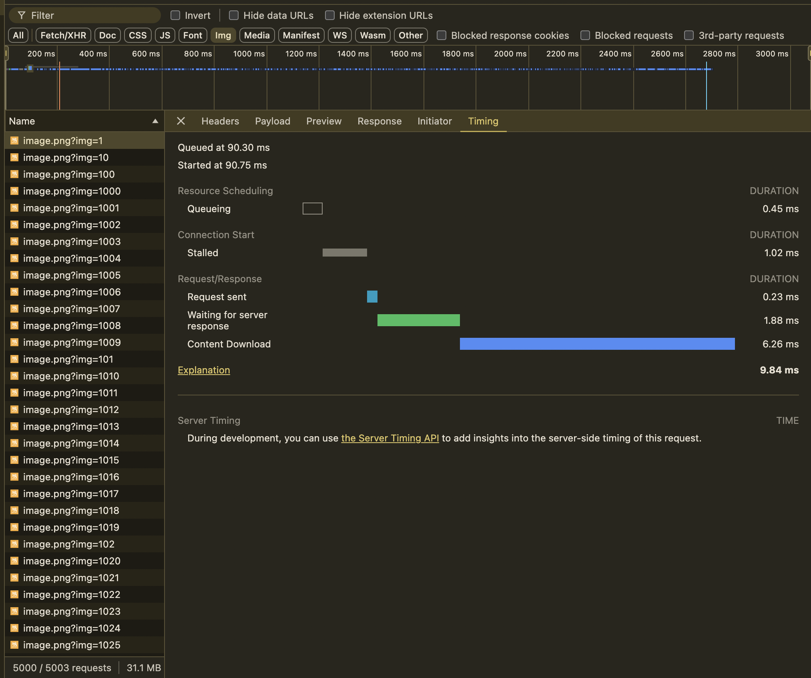
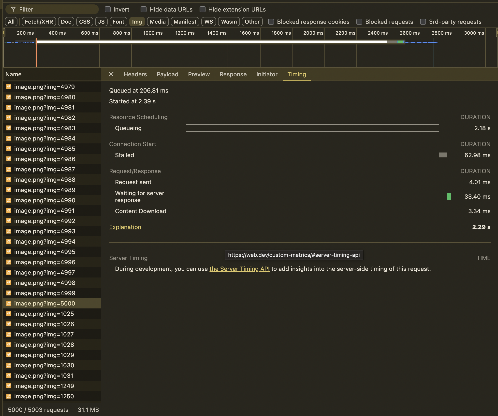
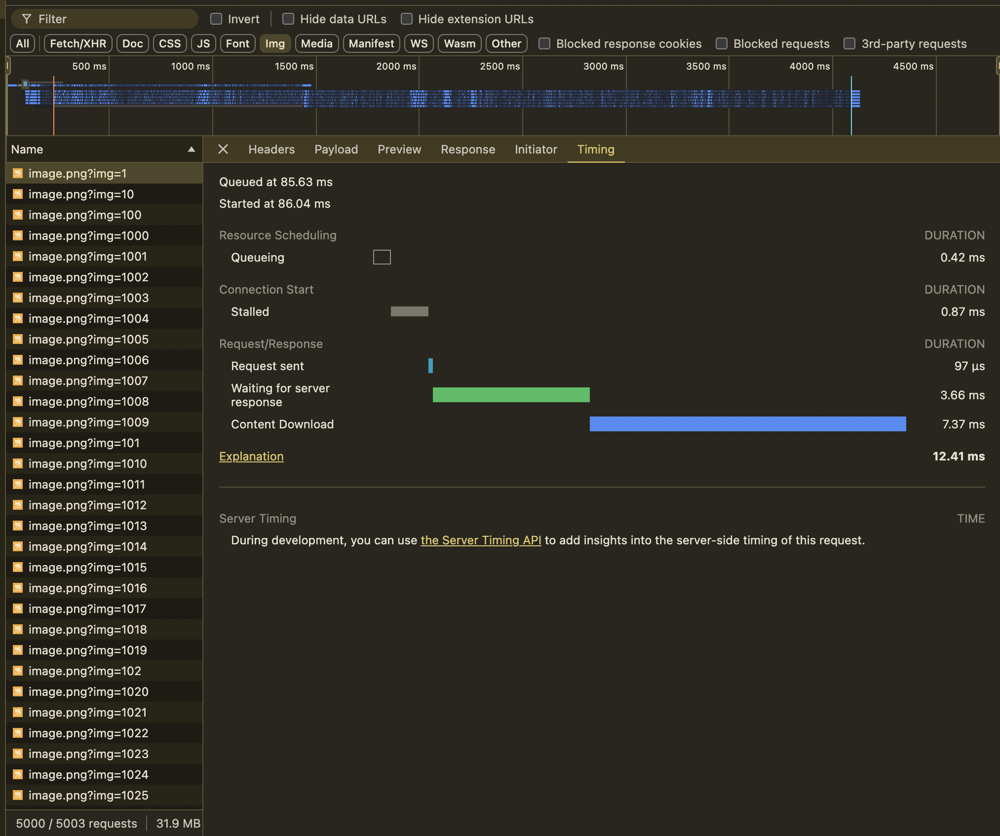
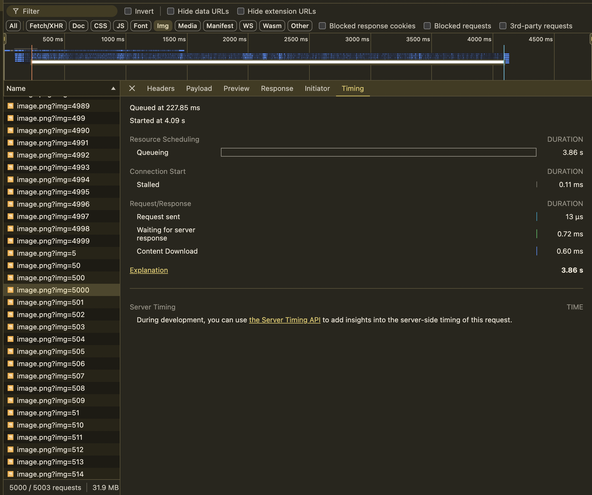

# HTTP/2 vs HTTP/1.x

### Task Overview
The goal of this task is to demonstrate the difference between HTTP/2 and HTTP/1.x protocols by focusing on how each handles concurrency when serving a large number of resources (e.g., images) from the same domain. 

HTTP/2 is designed to address the limitations of HTTP/1.x by allowing multiplexing, where multiple requests can be handled concurrently over a single connection.

### Solution
I implemented two servers: one using HTTP/1.x and the other using HTTP/2, both serving an HTML page that requests 5000 images using a simple script. The server serves the same image multiple times, but with different query parameters, creating the illusion of multiple different images. This approach allowed me to simulate a large number of simultaneous resource requests. 

The following sections outline the results, showcasing key differences in queuing time, consistency, and overall processing speed. All screenshots were captured from Chrome’s Developer Tools for proof.

### HTTP/2 Results

Image 1 (First Request)
- Queuing Time: 0.45ms
- Stalled Time: 1.02ms

Image 5000 (Last Request)
- Queuing Time: 2.18ms
- Stalled Time: 62.98ms

#### HTTP/2 analysis

HTTP/2 performs consistently across all 5000 requests, with finish times from 2.4ms to 2.7ms. One major difference in HTTP/2 is that there is no queuing that is common with HTTP/1.x. This is because HTTP/2 can handle multiple requests concurrently using multiplexing over a **single connection**.

For instance:
- Image 500 had a queuing time of 16ms.
- Image 1000 had a queuing time of 44ms.

This showcase that the order of requests is not as important since HTTP/2 is handling the requests in parallel, distributing the load. 

---

### HTTP/1.x Results

Image 1 (First Request)
- Queuing Time: 0.42ms
- Stalled Time: 0.87ms

Image 5000 (Last Request)
- Queuing Time: 3.86 seconds!
- Stalled Time: 0.11 ms

The browser quickly reaches its concurrency limit (6 requests per domain). Subsequent requests are queued until the previous ones complete. By the time the 5000th image request is made, the queuing time increases dramatically to 3.86 seconds, illustrating the bottleneck created by limited connections. 

Overall finish times for requests in HTTP/1.x were between 3.6ms and 4.5    ms, making it much slower and less consistent than HTTP/2.